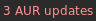

# aur-update

List available updates from the Arch User Repository (AUR)



Note: Logic depends on checking installed version against aurweb, so it doesn't
work well for VCS packages.
Instead, these need to run `makepkg --nodep -nobuild` on the actual `PKGBUILD`,
then either construct the version string via `makepkg --printsrcinfo` or parse
`makepkg --packagelist`, probably setting `PKG{DEST,EXT}` to controlled values
to make parsing more predictable.

## Setup / Usage

Example i3blocks configuration:

```
[aur-update]
command=$SCRIPT_DIR/aur-update
markup=pango
format=json
interval=43200
UPDATE_COLOR=red
QUIET=1
IGNORE=root vidyodesktop
#CACHE_UPDATES=0
#FORCE_IPV4=1
```

Right or middle click sends a notification (via notify-send) with a list of outdated packages
and the corresponding version information.
If you enable caching (`CACHE_UPDATES=1`), the update list will be cached as an environment variable.
This will be read on a (right/middle) click to directly show the notification without the delay caused by updating the list.
Usage of IPV4 can be forced using `FORCE_IPV4=1`. This is useful, because the AUR API often gets timeouts with IPV6 and the call does not return.


## Dependencies

- python3 [requests library](http://docs.python-requests.org/en/master/)
- optional: libnotify/notify-send
- pyalpm
