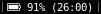
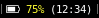
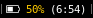
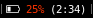
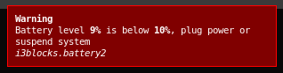

# battery2

## Show the current status of your battery

### Plugged and full


### Charging


### Discharging









### Unknown status


### No battery is present


## Show the notification when below threshold



# Dependencies (Debian like)

- `fonts-font-awesome`,
- `libnotify-bin`,
- `acpi`,
- `python3`

# Installation

To use with `i3blocks`, copy the blocklet configuration in the given
`i3blocks.conf` into your i3blocks configuration file, the recommended
config is:

```INI
[battery2]
command=$SCRIPT_DIR/battery2
markup=pango
interval=30
```
