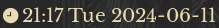
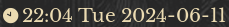

# datetime-icon

Display the current date and time alongside a nice analogue clock icon that changes based on the current hour.





# Dependencies

Any [patched Nerd font](https://github.com/ryanoasis/nerd-fonts)

# Installation

To use with i3blocks, add your chosen configuration to your i3blocks configuration file. Please ensure that the `command` option points to your local copy of `datetime-icon`.

Example configurations can be found in `i3blocks.conf`— one example configuration is as follows:

```INI
[datetime-icon]
command=$SCRIPT_DIR/datetime-icon
interval=5
```

# Customisation

You may change the date/time format displayed by `datetime-icon` by editing the script itself. A variety of example formats are included in the script. More information on date/time formatting can be found [here](https://www.man7.org/linux/man-pages/man1/date.1.html).
