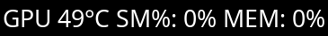

# gpu_load_smi

Displays information about the current state of a specific NVIDIA GPU using the `nvidia-smi` utility.

Although it will likely be zero, you should still confirm the GPU index.
The GPU index can be fetched by using the `nvidia-smi dmon` command.
`$ nvidia-smi dmon`
```
# gpu    pwr  gtemp  mtemp     sm    mem    enc    dec    jpg    ofa   mclk   pclk
# Idx      W      C      C      %      %      %      %      %      %    MHz    MHz
    0      3     51      -      0      0      0      0      0      0    405    210
```
The GPU index is the first column in the output. as depicted by the headers.
Identify which GPU index you want and use that as the `GPU_IDX` parameter.




# Dependencies
- nvidia-utils (contains the `nvidia-smi` binary)
- bash


```
[gpu_load_smi]
command=$SCRIPT_DIR/gpu-load
label=GPU
interval=5
GPU_IDX=0 // [YOUR_GPU_INDEX]
```

If you found this useful, I'd love to hear about it.
Feel free to email me: is@mhashmi.com
